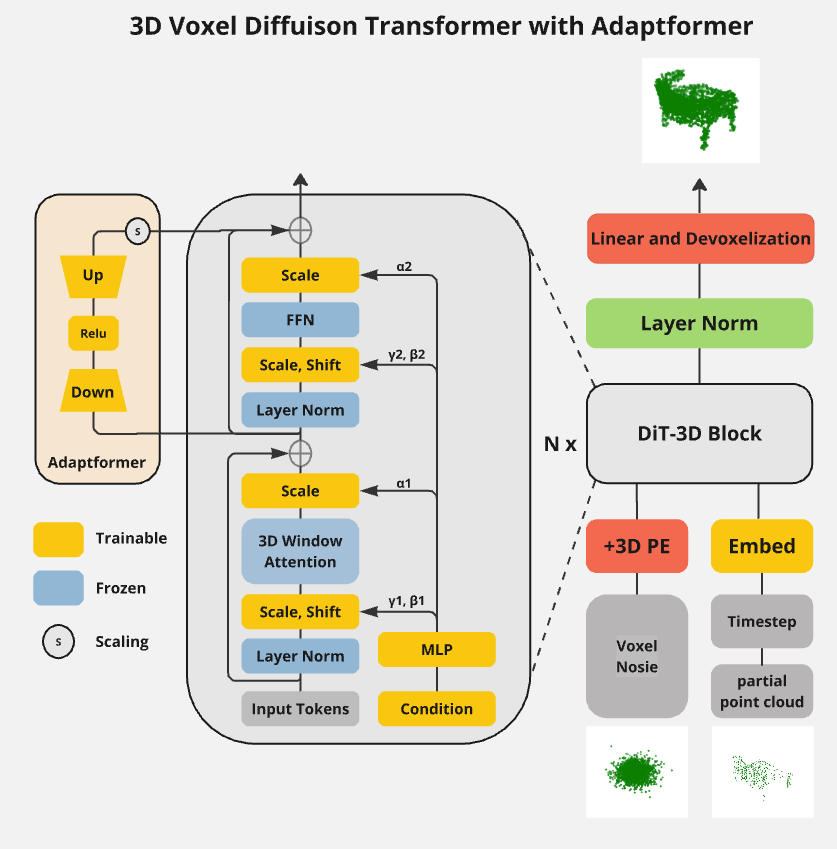

# 2024 AI Lab Shape Completion for Outdoor Environments

## Project Description

### What is 3D point cloud completion

\
With the widespread adoption of 3D scanning devices such as LiDAR, laser scanners, and RGB-D cameras, point clouds have become easier to capture, sparking significant research in fields like robotics, autonomous driving, 3D modeling, and manufacturing. However, due to challenges such as occlusion, reflection, transparency, and limitations in device resolution and angles, the raw point clouds directly captured by these devices are often sparse and partial. Therefore, generating complete point clouds from partial observations is crucial for advancing downstream applications. For example, 3D object detection tasks rely on complete point clouds to maintain state-of-the-art (SOTA) performance. Distant cars captured by LiDAR are often sparse and difficult to detect. Recent advances in deep learning (DL) have significantly improved the capability and robustness of point cloud completion, and the emergence of generative models has introduced new possibilities for this task.
<!-- Computer vision techniques are essential components of the perception systems in autonomous vehicles. These methods are used to interpret the vehicle's surroundings based on sensor data. 3D LiDAR sensors are often employed to gather sparse 3D point clouds from the environment. However, unlike human perception, these systems face challenges in inferring the unseen portions of the scene from these sparse point clouds. To address this issue, the scene completion task focuses on predicting the missing parts in the LiDAR measurements to create a more comprehensive representation of the scene. -->

### Project's goal

\
The main objective of this project is to use diffusion models combined with Vision Transformers to complete partial object point clouds. This project is primarily based on the research in [[2]](#references), where they successfully applied the Diffusion Transformer to the task of 3D point cloud generation. 

This project will further explore the potential of this model for point cloud completion by introducing a new conditional encoder for partial point clouds and incorporating AdaptFormer to improve the efficiency of model fine-tuning.

*(Clarify: The original objective was to complete scene point clouds based on the work in paper [[1]](#references). The goal was to explore the potential of using a Transformer, instead of the U-Net used in the diffusion model of that paper, for scene point cloud completion within the same framework. However, due to the large size of scene point cloud data, which demands very high GPU and CPU RAM capacity, the hardware performance was insufficient to meet the requirements. Therefore, the focus was shifted to the aforementioned goal.)*

<figure>
    
    <figcaption>The image above a example from the test set: the left is the partial point cloud, the middle is the ground truth, and the right is the point cloud reconstructed by the model.</figcaption>
</figure>

<!-- (The main objective of this project is to use diffusion models for scene completion from a single 3D LiDAR scan. This project builds on two studies: in the first study [[1]](#references), they used diffusion models and operated directly on points, reformulating the noise and denoise diffusion processes to enable the diffusion model to work efficiently at the scene scale for shape reconstruction. In the second study [[2]](#references), they proposed an innovative Diffusion Transformer for 3D shape generation, replacing the existing U-Net in diffusion models, which significantly improved the quality of 3D shape generation. **The goal of this project is to replace the diffusion model from the first study with the Transformer model from the second study and achieve scene reconstruction.**) -->

<!-- 
## Project Challenges

- [ ] TODO -->

## Installation

Install the following environments:
```
python==3.10
pytorch==2.1.2
torchvision==0.17.1
cudatoolkit==11.8
matplotlib==3.9.0
tqdm==4.66.4
open3d==0.18.0
trimesh=3.7.12
scipy==1.14.1
```
Build Cuda extension moduls: \
Tested on ubuntu 24.04, cuda 11.8, gcc 11.4
```bash
cd metrics/PyTorchEMD
python setup.py install
cp build/**/emd_cuda.cpython-36m-x86_64-linux-gnu.so .

cd voxel/cuda_voxelization
pip install .

cd voxel.cuda_devoxelization
pip install .
```

## Dataset

For generation, dataset `ShapeNetCore.v2.PC15k` can be downloaded [here](https://github.com/stevenygd/PointFlow), which is used in the paper [[2]](#references).

```
ShapeNetCore.v2.PC15k
├── Category1
│   ├── train
│   │   ├── pcd1.npy
│   │   ├── pcd2.npy
|   |    ...
|   ├── test
|   │   ├── pcd1.npy
|   │   ├── pcd2.npy
|   |    ...
│   └── val
│       ├── pcd1.npy
│       ├── pcd2.npy
|        ...
├── Category2
│   ├
 
 ...
```

For completion, dataset `ShapeNetCompletion` can be downloaded [here](https://gateway.infinitescript.com/s/ShapeNetCompletion)

```
ShapeNetCompletion
├── train
│   ├── complete
│   │   ├── category1
|   |   |    ├── pcd1.npy
|   |   |    ├── pcd2.npy
|   |   |     ...        
│   │   ├── category2
|   |        ...
│   └── partial
│       ├── category1
|       |    ├── pcd1
|       |    |    ├── 00.npy
|       |    |    |    ...
|       |    |    └── 07.npy
|       |    ├── pcd2
|       |    |    ├── 00.npy
|       |    |    |    ...
|       |    |    └── 07.npy
|       |    ├── pcd3
|       |     ...        
│       ├── category2
|        ...
├── test
│    ...
└── val
     ...
 
 ...
```


## Examples

- [ ] TODO - traning
- [ ] TODO - ...

## Trained model

- [ ] TODO upload final trained model weight to google drive

## Theory Part

### summary of the paper - [DiT-3D: Exploring Plain Diffusion Transformers for 3D Shape Generation](https://arxiv.org/pdf/2307.01831)

The Paper introduces a new method for 3D shape generation called DiT-3D (Diffusion Transformer for 3D shape generation). This method combines the strengths of diffusion models and Transformer architectures to generate high-quality 3D shapes (ShapeNet).Their method extends the diffusion model to the 3D domain for point cloud generation and introduces the 3D Window Attention module. It also fine-tunes using pre-trained data from Vision Transformers, significantly improving training efficiency and achieving state-of-the-art (SOTA) results in point cloud generation.

### New Contributions in This Project


The original paper implements the task of point cloud generation. (What is point cloud generation: the model receives a label for an object, such as "car" or "chair," and the model should output a shape that matches human perception of that label). 


### Diffusion model
DDPM (Denoising Diffusion Probabilistic Models) is a generative model that restores images through a step-by-step denoising process. 

<figure>
    
    <!-- <figcaption>DDPM .</figcaption> -->
</figure>


Assuming there are 1000 timesteps, starting from the original point cloud, random Gaussian noise is added at each step, which called the forward process. During training, the input is the point cloud at time t, along with t and the partial point cloud as conditions. The denoising model predicts the noise, and by subtracting the predicted noise from the noisy input point cloud, and the point cloud at time t-1 is obtained, this process is called the reverse process. This is then compared to the ground truth point cloud at time t-1 obtained in the forward process to calculate the loss. In the inference phase, a fully Gaussian noise point cloud is input, and after 1000 timesteps of the reverse process, the final generated point cloud is obtained.


### Denoise model - Diffusion Transformer
The Diffusion Transformer builds upon the Vision Transformer by incorporating adaLN-Zero. AdaLN is an extension of standard layer normalization that allows the layer normalization parameters to be dynamically adjusted based on the input data or additional conditional information (such as conditions added to the model, which can include classifications, text, or in this project, partial point clouds).

And due to the increased token length resulting from the additional dimension in 3D space, the computational cost of 3D Transformers can be significantly high. To address this issue, the paper [[2]](#references) introduces an efficient 3D window attention mechanism into the Transformer blocks, enabling the propagation of point-voxel features with efficient memory usage.

In this project, AdaptFormer is integrated to fine-tune the existing model weights, adapting the original generative task to a completion task. AdaptFormer is a plug-and-play, lightweight module that adds less than 2% extra parameters to the ViT, while enhancing its transferability without updating its original pre-trained parameters.

<div style="display: flex; justify-content: center; align-items: center;">
    
    
</div>


In addition, for generative tasks, we only need to specify the object we want to generate, i.e., the object’s classification label. However, for completion tasks, we need to input the partial point clouds, which requires an encoder to extract feature tokens from the incomplete point clouds. In this project, the proposed encoder remains consistent with the 3D diffusion transformer: first, it voxelizes the point clouds, then applies patchify to obtain a series of tokens and feeds them into Vision Transformers, and finally uses max pooling to produce a single final token. 

<figure>
    
    <!-- <figcaption></figcaption> -->
</figure>


Here, the structure and complexity(like the number of ViT Blocks, in the project is setted as 3) of the encoder also significantly impact the final completion results. Other possible structures include encoders like those in PointNet [[3]](#references) or U-Net-based encoders. And the choice of max pooling is motivated by the fact that, as noted in PointNet, due to the unordered nature of point clouds, a symmetric function is needed to aggregate information from all points. It has been demonstrated that when the feature dimensions are sufficiently large, max pooling can approximate any symmetric function f described in the paper. However, in this project, with the use of Transformers, the point clouds are first patchified and positional information is assigned to each patch, it disrupts the unordered nature of the point clouds.. Therefore, other pooling methods could also be considered for the final step.

## Result

### Traninig

During training, the model weights were saved every 50 epochs. The figure below shows the performance of the model on the validation dataset at each saved checkpoint, with the metric being the 1-NNA Chamfer Distance.

<figure>
    
    <!-- <figcaption></figcaption> -->
</figure>

We can observe that during global fine-tuning, the training reached the 300th epoch, the Chamfer Distance did not decrease, the model's performance did not improve.

In the model using adaptformer, we can see that the performance of the model was very noticeable imporoved. The Chamfer Distance decreased significantly from close to 1 at the beginning to a minimum of 0.20. Ultimately, the model weights with the lowest Chamfer Distance were selected for subsequent testing.

The training has currently reached 1200 iterations, starting fine-tuning from the weights at epoch 7650 of the original paper to epoch 8850. For the new added dataset for completion tasl `ShapeNetCompletion` , each complete point cloud corresponds to 8 partial point clouds. If the dataloader outputs the partial and complete point clouds in a one-to-one manner, the memory requirements for the dataloader are very high. In this project, a distributed training approach is used, where each data loader loads only one partial point cloud at a time and trains for 300 epochs (for example, the data loader contains only the partial point cloud with index 00 and its corresponding complete point cloud. The dataset structure is detailed [here](#dataset).). In this project, training was conducted for 300 epochs each for indices 00, 02, 04, and 06 of the partial point cloud.

However, this training approach reduces the computational load on the computer but also result in decreased model accuracy. Additionally, training for 1200 epochs does not ensure that the model has fully converged, and further fine-tuning may still improve the model's accuracy.

- [ ]TODO finetune using DiffFit ([paper]("https://arxiv.org/pdf/2304.06648))

**Summary of training configurations:**
| Hyperparameter | Value |
|:-------------|:---------------:|
| architecture design     | DiT + 3D windown attention + Adaptformer (12 DiT blocks in DiT, 3 ViT blocks in condition encoder)        |
| iteration count | 1200 |
| learning rate | 1e-4 |
| diffusion steps | 1000 |
| noise scheduler | Linear |
| sampler scheduler | Uniform |
| optimizier | AdamW |
| betas for optimizer | (0.9, 0.999) |
| weight decay | 0.0 |
| dropout | 0.0 |
| loss function | MSE |
| the point number of partial point cloud | 512 |
| the point number of complete point cloud | 2048 |
| batch size | 16 |
| voxelization resolution | 32 |

### Evaluation 

**Evaluation on test dataset - epoch 8649:**
| CD Average⭣ | EMD Average⭣ | f1 Average⭣| 1-NNA-CD⭣ | 1-NNA-EMD⭣ | COV-CD⭡ | COV-EMD⭡ |
|:-------------|:---------------:|--------------:|--------------:|--------------:|--------------:|--------------:|
| 0.0032 |60.0785 | 0.6358 | 0.29         | 0.45       | 0.71          | 0.61          | 

**Evaluation on validation dataset - epoch 8649:**
|CD Average⭣ |EMD Average⭣ | f1 Average⭣ | 1-NNA-CD⭣ | 1-NNA-EMD⭣ | COV-ECD⭡ | COV-EMD⭡ |
|:-------------|:---------------:|--------------:|--------------:|--------------:|--------------:|--------------:|
| 0.0027 | 60.0288 | 0.6939 | 0.20     | 0.38         | 0.84        | 0.60        |

**Evaluation on test dataset with sparse point cloud - epoch 8649:**

|CD Averagee⭣ | EMD Average⭣ | f1 Average⭣ | 1-NNA-CD⭣ | 1-NNA-EMD⭣ | COV-CD⭡ | COV-EMD⭡ |
|:-------------|:---------------:|--------------:|--------------:|--------------:|--------------:|--------------:|
| 0.0028 | 57.3172 |0.6759| 0.26         | 0.43       | 0.71          | 0.58          |

(⭣ means the lower the better, ⭡ means the higher the better)

*(Sparse point clouds are generated by randomly sampling fewer points from the complete point clouds in the test set. In the `ShapeNetCompletion` dataset, partial point clouds are the result of removing a part of the object, but sparse point clouds consist of the entire shape of the object but with very few points.)*


From the data, it is evident that this result still has a significant performance gap compared to the state-of-the-art (SOTA).

- [ ]TODO Find a suitable baseline to compare the performance gap.

In Paper [SpareNet](https://arxiv.org/pdf/2103.02535), their average CD value for the chair category is 0.000616.

### Detailed Case Analysis and visualization

#### Cases from test set:

|  |  |  |
|---------|---------|---------|
|  |  |  |
|  |  |  |
|  |  |  |
|  |  |  |
|  |  | |

The examples above are from the dataset, with the left side showing the point clouds reconstructed by the model and the right side displaying the ground truth. It can be observed that the model possesses a basic ability to restore partial point clouds. The model can distinguish the shapes of objects such as the structure of a chair, including its four legs and backrest (e.g., the first row, first column), the driver's seat of a car (e.g., the third row, third column), a sofa (e.g., the fourth row, second column), and a swivel chair (e.g., the fifth row, first column). And the reconstructed shapes are distinguishable and align with logical expectations.

For basic chair structures (such as those in the first, second, and the first two columns of the third rows), the model's reconstruction is more accurate than for other shapes. However, there are still significant deviations in the details. For example, the chair in the second row, second column, as well as the chairs in the third row, second column, and the fifth row, second column, show discrepancies in the legs compared to the ground truth and fail to cover the input partial point cloud. The car driver's seat only reconstructs a rough shape, missing most of the finer details. The chair in the fourth row, third column, contains structural errors in its reconstruction, and the swivel chair in the fifth row, first column, has incorrect structural reconstruction in the base.

<!-- #### different levels sampling on partial point cloud
- [ ]TODO

#### different levels sampling on sparse point cloud
Sampling sparse point clouds with different levels of density from the ground truth was used as input conditions for the model to observe the impact of different point numbers on the final point cloud reconstruction quality, using Chamfer Distance Average.

**case 1** 

 -->


<!-- #### The diversity of reconstructions generated by the model
- [ ]TODO -->


<!-- ## Project status
June:
- [x] Startup: try SemanticKITTI Dataset, and diffuison model training
  - [x] to document(**Done**: Understand and try some programming on the datasets ShapeNet and KITTI360-test-demo. SemanticKITTI (80GB) is too large to download on my own computer. Use Open3D for visualization and PyntCloud for voxelization.) `13.06`
  - [ ] ? voxelization module from DiT3D ( actually from PVCnn)

- [ ] TODO - repoduce the results from the two stduies\
`Device issues can't be resolved, linux system required (PytorchEMD, MinkowskiEngine, pytorch3d)`
  - -[x] TODO [code[1]](https://github.com/PRBonn/LiDiff)
    - the [result](tryout/Lidiff/) from example pipeline 
  - [code[2]](https://github.com/DiT-3D/DiT-3D)
- [ ] TODO - try replace the model with Diffusion Transformer 3D
  - should convert the point cloud into a voxel representation or figure out other way to direct use the point could data.
  - ...
- [ ] compare the results
  - metrics: $CD$(chamfer distance), $JSD_{BEV}$(jensen-Shannon divergence), $IoU$ (intersection-over-union)
- [ ] ...
## Modules
### pytorchEMD
PyTorch Wrapper for Earth-Mover-Distance (EMD) for 3D point cloud regression, source from [github](https://github.com/daerduoCarey/PyTorchEMD).

But the TH/THC (`fatal error: THC/THC.h: No such file or directory`) include files have been removed in the latest pytorch version. I removed THC/THC.h and updated all the deprecated functions, you can find code in [here](tryout/PyTorchEMD/).

build with command:
```bash
pip install .
```
The code is tested on Ubuntu 24.04, python 3.10, pytroch 2.1.2, CUDA 11.8. -->


## Recommaned papers
DDPM:
-  [Denoising Diffusion Probabilistic Models](https://arxiv.org/abs/2006.11239)
- [Understanding Diffusion Models: A Unified Perspective](https://arxiv.org/pdf/2208.11970) - math theory

Vision Transformer:

- [AN IMAGE IS WORTH 16X16 WORDS: TRANSFORMERS FOR IMAGE RECOGNITION AT SCALE](https://arxiv.org/pdf/2010.11929)

Diffusion Transformer:

- [Scalable Diffusion Models with Transformers](https://arxiv.org/pdf/2212.09748)

PointNet:

- [PointNet: Deep Learning on Point Sets for 3D Classification and Segmentation](https://arxiv.org/pdf/1612.00593)

3D Completion:

- [A CONDITIONAL POINT DIFFUSION-REFINEMENT PARADIGM FOR 3D POINT CLOUD COMPLETION](https://arxiv.org/pdf/2112.03530)


## References

1. [Nunes, L., Marcuzzi, R., Mersch, B., Behley, J., & Stachniss, C. (2024). Scaling Diffusion Models to Real-World 3D LiDAR Scene Completion. arXiv preprint arXiv:2403.13470.](https://arxiv.org/abs/2403.13470)

2. [Mo, S., Xie, E., Chu, R., Hong, L., Niessner, M., & Li, Z. (2024). Dit-3d: Exploring plain diffusion transformers for 3d shape generation. Advances in Neural Information Processing Systems, 36.](https://arxiv.org/abs/2307.01831)

3. [Qi C R, Su H, Mo K, et al. Pointnet: Deep learning on point sets for 3d classification and segmentation[C]//Proceedings of the IEEE conference on computer vision and pattern recognition. 2017: 652-660.](https://arxiv.org/pdf/1612.00593)